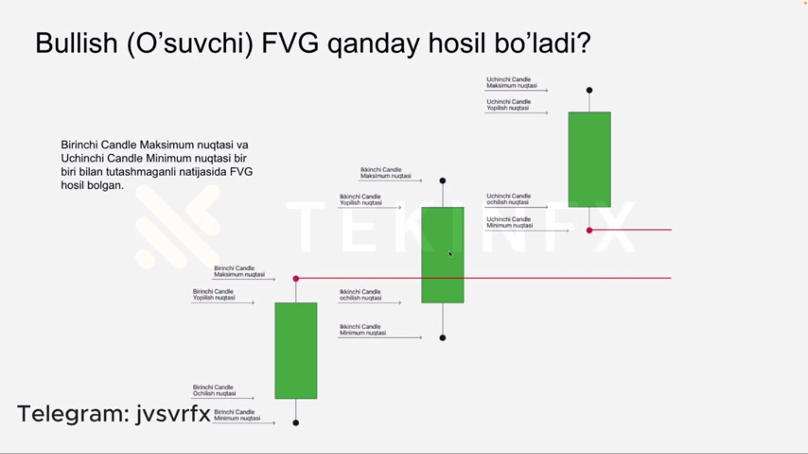

Bozorda FVG ni topish osson . Bozor xar doim impuls dan keyin FVG qoldirib ketadi . FVG ning xosil bo'lishi 👇

 Yani o'suvchi trend da (bullish trend) birinchi shamcha (yani pasdagi) ning soyasi ( shpilkasi )dan uchinchi shamchaning soyasining minimumi gacham xisoblanadi . 2-shamcha impuls bo'lishi shart  Bearish ( tushuvchi ) trend da esa shuning teskarisi bo'ladi!!

 Bozor FVG ni yomon ko'radi . FVG xosil bo'lsa imkon qadar tezroq ypishga xarakat qiladi !!!!