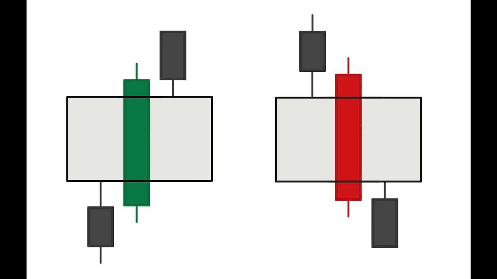

Bozorda FVG ni topish osson . Bozor xar doim impuls dan keyin FVG qoldirib ketadi . FVG ning xosil bo'lishi 👇

 Yani o'suvchi trend da (bullish trend) birinchi shamcha (yani pasdagi) ning soyasi ( shpilkasi )dan uchinchi shamchaning soyasining minimumi gacham xisoblanadi . 2-shamcha impuls bo'lishi shart 
