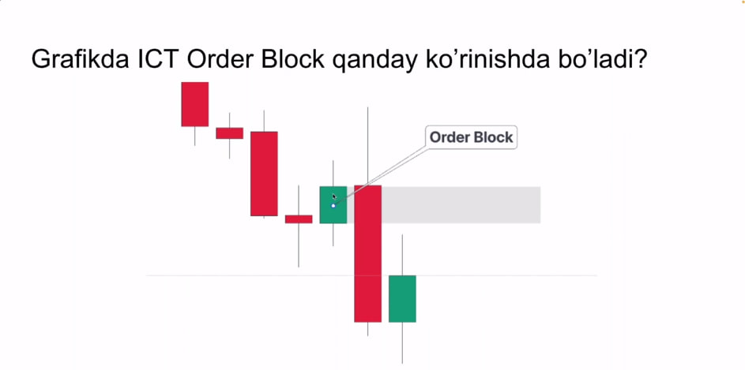
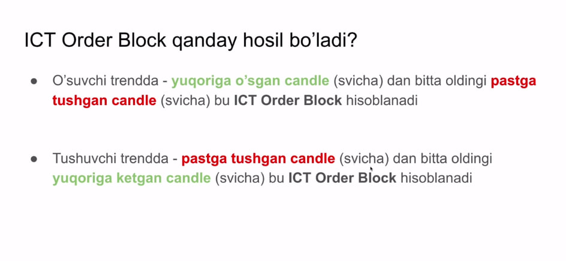
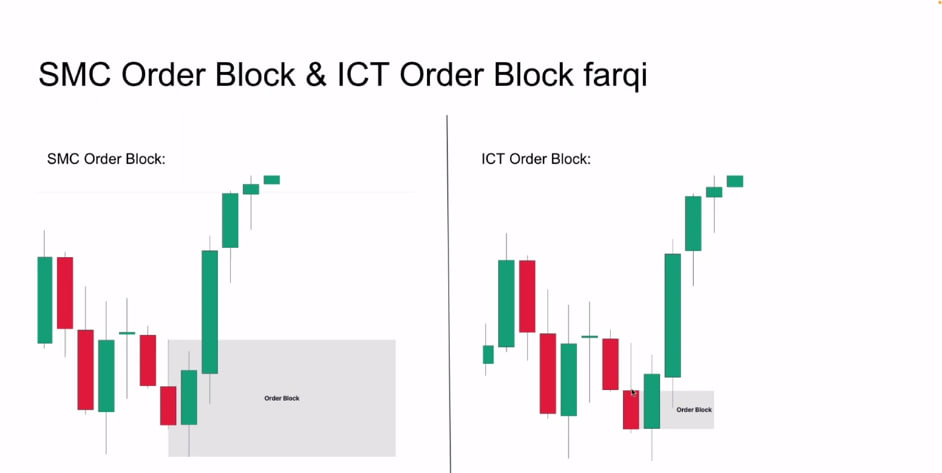

  OB - buyurtma bloki 
         *  Yani bozorda valyuta olinish (buy ) yoki sotilish (sell) amalga oshiriladigan zona
         *  OB ning 50% nuqtasi muhim !!!
         *  OB xamma timefrem da ishlaydi
         *  Narx biron bir yo'nalishga yurishdan oldin yopilgan svicha (Shamcha) OB bo'la oladi

 

 !! qoida

 

 !! SMC bilan farqi 
 